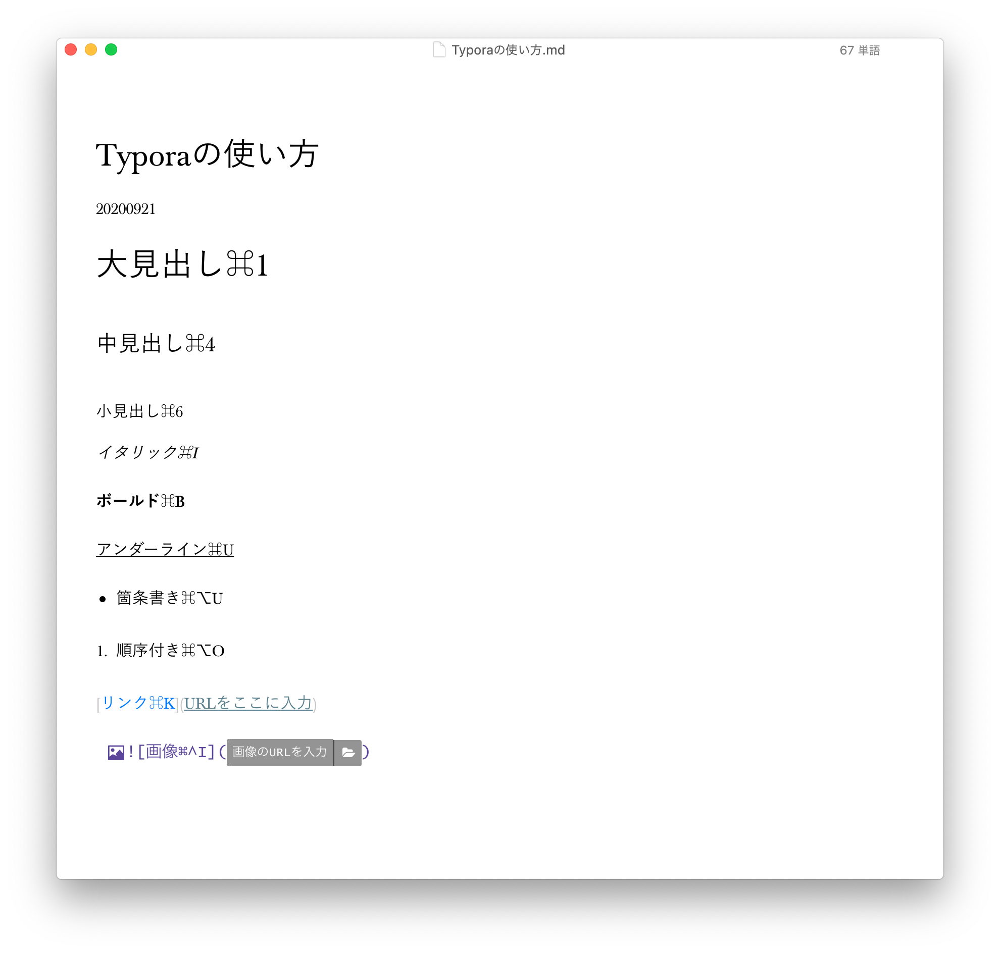

# kefuno. Webpage概要
20200921

kefuno.のWebpageの概要と更新方法の説明です。できるだけ詳しく説明しているので，後ほどまとめます。

### 概要

kefuno.は以前作成した[orchestramusicart.com](https://orchestramusicart.com/)をベースに作りました。

使っているホスティングサービス(webpageを公開するサービス)はGithub pagesという無料のサービスです。ホームページを簡単に作れる「Wix」やブログを公開できる「はてな」や「note」とは違い，基本的には一からコードを書く必要があります。また元々はテック系のブログを簡単に公開するためのサービスだったこともあり，ホームページのために使える機能は最低限になっています。ただその分限られた範囲内であれば好きにカスタマイズでき，かつ永年無料で使えます。その上，最近は他に無料で使える便利なサービスもあるので追加できる機能は年々増えています。例えばGithub pagesではホームページの更新は手動で行う必要がありますが，kefuno.ではtravis ciを使うことでほとんど自動化しています。（これも無料!）

Githubに新しい記事を追加すると以下のようにして自動で加工されます。

つまり，Githubに記事をアップロードすることだけで自動で記事は更新されます。

そこで，Githubへのアップロードに必要な作業を説明しましょう。

### 記事の更新

#### 概要

1. [Github](https://github.com/)に登録（無料）
2. [Typora](https://typora.io/)などのMarkdownエディターをダウンロード（任意）
3. [kefunoApp](https://drive.google.com/drive/folders/1kzm8L9L5cfZlcCe8NeypSEr5lD7uTl5I?usp=sharing)をダウンロード
4. kefunoAppを起動し，記事フォルダ（記事と，設定ファイルや写真など入っているフォルダ）を作成
5. 記事フォルダ内のMarkdownファイルを編集
6. 記事フォルダをGithubにアップロード
7. 完了！

１〜３は初期設定ですので，一度設定しましたら４以降をご参照ください。

#### 1. Githubに登録

[こちら](https://github.com/)からGithubアカウントに登録してください(無料)。

日本語には対応していませんが，適当なユーザー名とメールアドレスを登録するだけでOKです。他は全てスキップして大丈夫です。  
メールアドレス認証まで終わりましたらmiguelまでアカウント名とメールアドレスをお知らせください。編集者として登録しアップロードできるようにします。

登録手順の細かい説明も追加するので，どうしてもわからないことがあればそちらをご参照ください。

#### 2. Typoraをダウンロード

ウェブページは基本HTMLという言語で書かれています。ただ，それを全て学ぶのは時間がかかりますし記事の更新には不要なので，その簡易記法である**Markdown**で記事を書きます。（書ける方はHTMLやXMLで書いていただいて構いません。設定を変更するのでご相談ください。）

Markdownはすごく簡単ですが，更に簡単に作成できるようにTyporaというアプリをお勧めします。

##### ダウンロード方法

[こちら](https://typora.io/)からTyporaをダウンロードします。(今のところ)無料です。

少しスクロールすると出てくる右上のDownloadボタンからダウンロードします。パソコンのOSに合わせて使ってください

Typoraを開けるまでは，インストーラーの手順に沿って進めてください。

##### Typoraの設定

Typoraを開けましたらいくつか設定を加えます。

そのままでも使えますが，画像をアップロードするにあたってその保存場所を設定する必要があるので**必ず確認してください。**

① OSによって場所は少し違いますが，上のメニューバーから**ファイル>設定**(Macなら**Typora>設定**)で設定画面を開きます。

②メニューから「画像」を選択し，When Insert...に「**指定したフォルダに画像をコピー**」を選択した上で`./assets`と入力してください。(Windowsの場合は設定方法が少し違うかもしれません)

Macの場合は自動で画像をアップロードしてくれる「iPic」というアプリを使うこともできます。（この機能はまだテスト中ですので，実際に使うのは少々お待ちください。）

When Insert...に「Upload Image」，Image Upload Settingに「iPic」をまず選択し，Download iPicボタンを押してください。

iPicを開いたら，Test Uploaderボタンを押します。下のような画面が出たら成功です。

⑤ ここまでできたら，Typoraを**一度終了し再起動します。**

Typoraの使い方は別途用意しますので，そちらを参考にしてください。

#### 3. kefunoAppをダウンロード

記事を更新する場合，そのタイトルやURLなども含めて設定しなければいけません。また写真などもあるので，記事のファイルをアップロードするだけでは記事は更新できません。

そこで，kefunoAppにタイトルやURLなどを入力すると，設定情報や写真などをまとめて含んだ「記事フォルダ」が記事ごとに作成されます。

kefunoAppを[こちら](src/news/markdown/assets/kefuno.zip)からダウンロードしてご使用ください。（Macでは外部サイトからダウンロードしたアプリは開けない場合があります。[こちら](https://pc-karuma.net/download-app-security/)を参考に設定してください。）

#### 4. kefunoAppを起動し記事を書く

kefunoAppが開けたら下記のような画面が表示されます。各項目について説明します。（デザインは変わる可能性があります）

- フォルダー

  記事フォルダを作る場所。Browseボタンから選択できます。

- タイトル

  記事のタイトル。スペースや記号の使用は可能ですが，スラッシュ記号（/,\\)は必要なら全角で入力してください。

- URL

  記事を公開するURL。英数字のみでお願いします。

  デフォルトでは"news{id}_{日付}"になっています。idは自動で設定されますが，公開日に合わせて日付を変更したり情報を付け足したりしても構いません。

- 著者

  記事の作成者。公開はされませんが，エラーなどが起きたときに連絡取るために適当な名前を入力してください。

- タグ

  記事のジャンル。記事の検索に用います。追加したいタグがありましたらご相談ください。

情報を入力しましたら**ファイルを作成**ボタンで記事ファイルが作成されます。

#### 5. 記事フォルダ内のMarkdownを編集

記事フォルダ内に"{タイトル}.md"というファイルが作成されます。これをTyporaなどで開き上げたい記事を記入してください。デフォルトでは，タイトルと日付が記入されています。

Typoraは基本的にはメモ帳やテキストエディタと同じような使い方ができます。違うのはMarkdownやHTMLで書けることと，色々なショートカットがあることです。Markdownについては別途説明しますが，Macでのショートカットについては以下の図を参考に見出しやスタイリングを試してみてください。

上のメニューバーの「段落」や「フォーマット」メニューからも選択できるので，ショートカットを覚えるのは必須ではないです。よく使うものとしては

- 見出しは⌘(command)+１〜６
- ボールドは⌘(comand)B
- イタリックは⌘(command)I

などがあります。

写真やリンクもショートカットがありますが，ファイルやウェブサイトから直接ドラッグ&ドロップしても自動で追加できます。

デフォルトではkefuno.で使用されているフォントは使えません。設定＞表示＞「テーマフォルダを開く」からテーマフォルダを開き， [こちら](./assets/kefunoStyle.zip)からダウンロードできる`kefuno.css`と`kefunoFonts`をそこに追加してください 。再起動すると，メニューバーもしくは設定からテーマ＞Kefunoでウェブサイトと同じテーマが使用できるはずです。

#### 6. 記事フォルダをGithubにアップロード

完成しましたら，記事フォルダごとGithubにアップロードします。

[こちら](https://github.com/manimigue/kefuno/upload/master/news)を開き，以下のように記事をアップロードしコミットします。

①アップロード

②忘れずに**Commit changes**ボタンを押す

#### 7. 完了！

しばらくしたら[manimigue.github.io/kefuno](https://manimigue.github.io/kefuno/)に反映されます。

問題，質問ありましたらmiguelまでお願いします。
